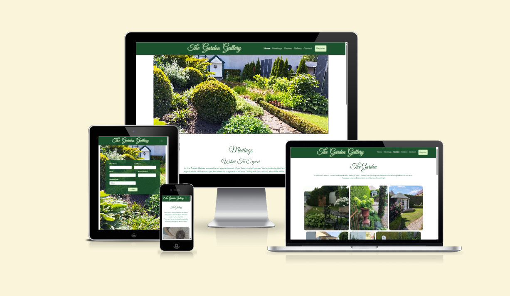
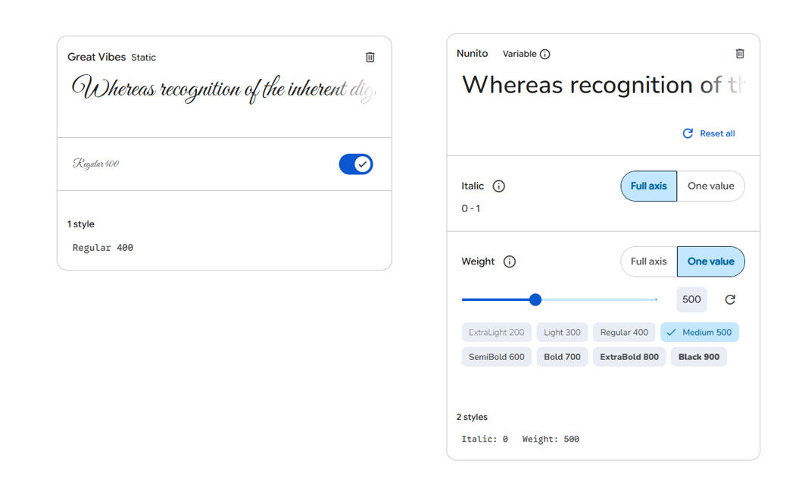

# The Garden Gallery

The Garden Gallery is small business, that operates from a private property in Radefeld Germany. The aim of the business is to organize social events, where a group of people sign up for a tour of the french styled garden. After the tour, they will be introduced to an art gallery, where they can make purchases. The goal of this website, is to increase their online presence and draw more people on a regular basis to their events.

The live website can be viewed here: [The Garden Gallery](https://gary-burke.github.io/the-garden-gallery/)

---

## CONTENTS

* [User Experience](#user-experience)
  * [User Stories](#user-stories)

* [Design](#design)
  * [Colour Scheme](#colour-scheme)
  * [Typography](#typography)
  * [Wireframes](#wireframes)

* [Features](#features)
  * [General Features on Each Page](#general-features-on-each-page)
  * [Future Implementations](#future-implementations)
  * [Accessibility](#accessibility)

* [Technologies Used](#technologies-used)
  * [Languages Used](#languages-used)
  * [Frameworks, Libraries & Programs Used](#frameworks-libraries--programs-used)

* [Deployment & Local Development](#deployment--local-development)
  * [Deployment](#deployment)
  * [Local Development](#local-development)
    * [How to Fork](#how-to-fork)
    * [How to Clone](#how-to-clone)

* [Testing](#testing)

* [Credits](#credits)
  * [Code Used](#code-used)
  * [Content](#content)
  * [Media](#media)
  * [Acknowledgments](#acknowledgments)
---

## User Experience

### User Stories

* As a potential new visitor, I would like to see a home page, that describes exactly what the event is about and what the entrance fees are.

* As a potential new visitor, it would be helpful if there were links with an image for guidance, to navigate to separate dedicated pages, which showcases the garden and the galley.

* As a garden enthusiast, I want to see a few pictures, showcasing the Garden and what to expect. If possible, a video frame from Youtube, in regards to this garden and event.

* As an art enthusiast, I want to see a few pictures, showcasing the Gallery with multiple artwork.

* As a customer, there should be easily accessible and visible buttons throughout the website, where I can effortlessly register for an event.

* As a customer, I would like to see some sort of confirmation upon successful registration.

* As a potential visitor, there needs to be a clear and easily accessible contact section.

* As a potential visitor, it would be helpful to have a consistent and clear navigation system throughout the website.

## Design

### Typography

I have used Google Fonts for this project and chose the following two fonts:

- **Great Vibes:** Used for all the main headings in the website. In order to accomodate the idea of the business, I opted for a artistic floral type of design. This font fit that criteria perfectly, aesthetically plaesing, yet still simple enough to read easily.
- **Nunito:** Used for all other text in on the website. It provides a great blend of complementing the heading but with a stark enough contrast to make reading easy.

 In order to test the contrast between the two fronts, I used [fontjoy](https://fontjoy.com/).

 

### Colour Scheme

When thinking of the word "Garden", the colour green automatically comes to mind. Therefore, I used [Coolors](https://coolors.co/) to find a green colour palette that resemblances this thought and feeling of nature.

Here is a visual representation of the overall colour scheme of the website:

### Accessibility Considerations

Ensuring strong colour contrast for readability was a key design principle from the outset. Before development, the colour choices were tested using the [WebAIM Contrast Checker](https://webaim.org/resources/contrastchecker/) to confirm compliance with WCAG (Web Content Accessibility Guidelines). The goal was to maintain high contrast ratios for text elements, particularly for call-to-action buttons and important information, ensuring the site is accessible to users with visual impairments or colour blindness.

## Features

### Current Features

- __Navigation Bar__

  - Explain the nav bar
  - Explain the styles of the nav bar
  - Add Screenshot

- __The landing page__

  - Explain
  - Explain the styles
  - Add Screenshot

- __Business Background__

  - Explain
  - Explain the styles
  - Add Screenshot

- __Footer__

  - Explain
  - Explain the styles
  - Add Screenshot

- __The Gallery Page__

  - Explain
  - Explain the styles 
  - Add Screenshot

- __The Garden Page__

  - Explain 
  - Explain the styles 
  - Add Screenshot

- __The Sign Up Page__

  - Explain 
  - Explain the styles 
  - Add Screenshot

### Future Features

- __Online Store__

  - Explain 

## Testing 

In this section, you need to convince the assessor that you have conducted enough testing to legitimately believe that the site works well. Essentially, in this part you will want to go over all of your project’s features and ensure that they all work as intended, with the project providing an easy and straightforward way for the users to achieve their goals.

In addition, you should mention in this section how your project looks and works on different browsers and screen sizes.

You should also mention in this section any interesting bugs or problems you discovered during your testing, even if you haven't addressed them yet.

If this section grows too long, you may want to split it off into a separate file and link to it from here.

### Validator Testing 

- HTML
  - No errors were returned when passing through the official [W3C validator](https://validator.w3.org/nu/?doc=https%3A%2F%2Fcode-institute-org.github.io%2Flove-running-2.0%2Findex.html)
- CSS
  - No errors were found when passing through the official [(Jigsaw) validator](https://jigsaw.w3.org/css-validator/validator?uri=https%3A%2F%2Fvalidator.w3.org%2Fnu%2F%3Fdoc%3Dhttps%253A%252F%252Fcode-institute-org.github.io%252Flove-running-2.0%252Findex.html&profile=css3svg&usermedium=all&warning=1&vextwarning=&lang=en#css)

### Resolved Bugs

- Favicon - My initial favicon did not display and then I realized, that I had to update the paths for the images. The initial code, generated by [favicon.io](https://favicon.io) called for the images to be placed in the root directory.
- Buttons - Using Bootstrap buttons, I changed their styles but realized when clicking on the button, it still displayed the default blue colour. I had forgotten to remove the "btn-primary" class from the buttons and now it works as expected.

### Unresolved Bugs

There are no known bugs in the webiste.

## Deployment

This website was deployed to GitHub pages by the following process:

- Open the repository in GitHub.
- Open the Settings tab.
- Go to the Pages section under Code and automation.
- Navigate to the Build and deployment section.
- From the Branch dropdown menu, select Main and save.
- Once the site has been delpoyed, the url will be displayed in this Pages section.
- You might need to refresh GitHub manually after a few seconds.

The live website can be viewed here: [The Garden Gallery](https://gary-burke.github.io/the-garden-gallery/)

## Credits 

In this section you need to reference where you got your content, media and extra help from. It is common practice to use code from other repositories and tutorials, however, it is important to be very specific about these sources to avoid plagiarism. 

You can break the credits section up into Content and Media, depending on what you have included in your project. 

### Content 

- The text for the Home page was taken from Wikipedia Article A
- Instructions on how to implement form validation on the Sign Up page was taken from [Specific YouTube Tutorial](https://www.youtube.com/)
- The icons in the footer were taken from [Font Awesome](https://fontawesome.com/)

### Media

- The photos used on the home and sign up page are from This Open Source site
- The images used for the gallery page were taken from this other open source site

Congratulations on completing your Readme, you have made another big stride in the direction of being a developer! 

## Other General Project Advice

Below you will find a couple of extra tips that may be helpful when completing your project. Remember that each of these projects will become part of your final portfolio so it’s important to allow enough time to showcase your best work! 

- One of the most basic elements of keeping a healthy commit history is with the commit message. When getting started with your project, read through [this article](https://chris.beams.io/posts/git-commit/) by Chris Beams on How to Write  a Git Commit Message 
  - Make sure to keep the messages in the imperative mood 

- When naming the files in your project directory, make sure to consider meaningful naming of files, point to specific names and sections of content.
  - For example, instead of naming an image used ‘image1.png’ consider naming it ‘landing_page_img.png’. This will ensure that there are clear file paths kept. 

- Do some extra research on good and bad coding practices, there are a handful of useful articles to read, consider reviewing the following list when getting started:
  - [Writing Your Best Code](https://learn.shayhowe.com/html-css/writing-your-best-code/)
  - [HTML & CSS Coding Best Practices](https://medium.com/@inceptiondj.info/html-css-coding-best-practice-fadb9870a00f)
  - [Google HTML/CSS Style Guide](https://google.github.io/styleguide/htmlcssguide.html#General)