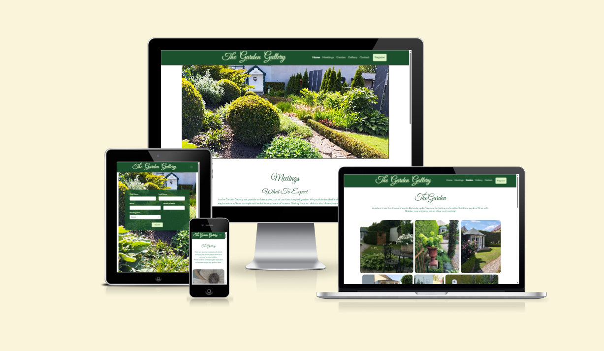
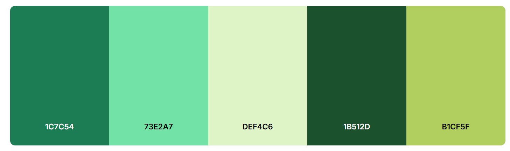
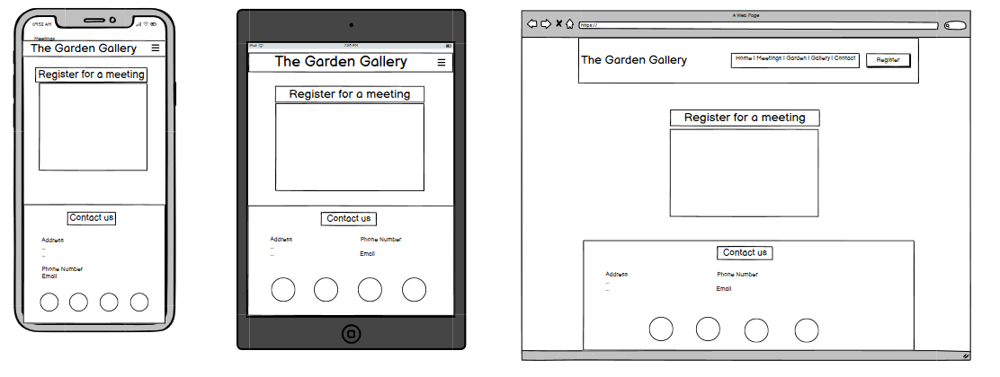
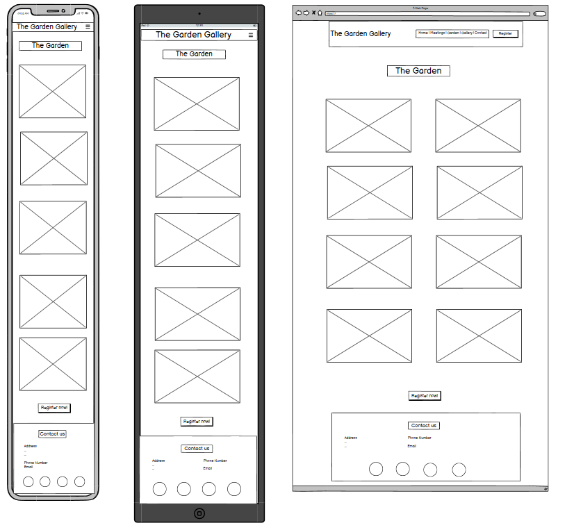
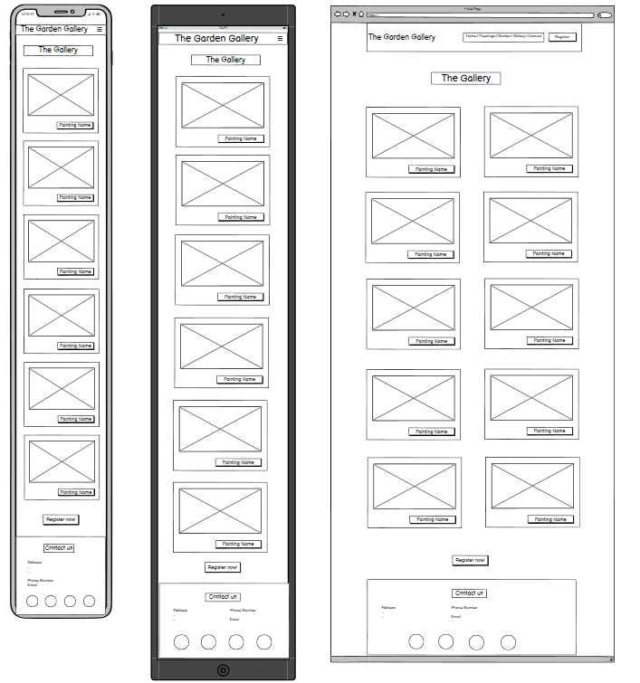
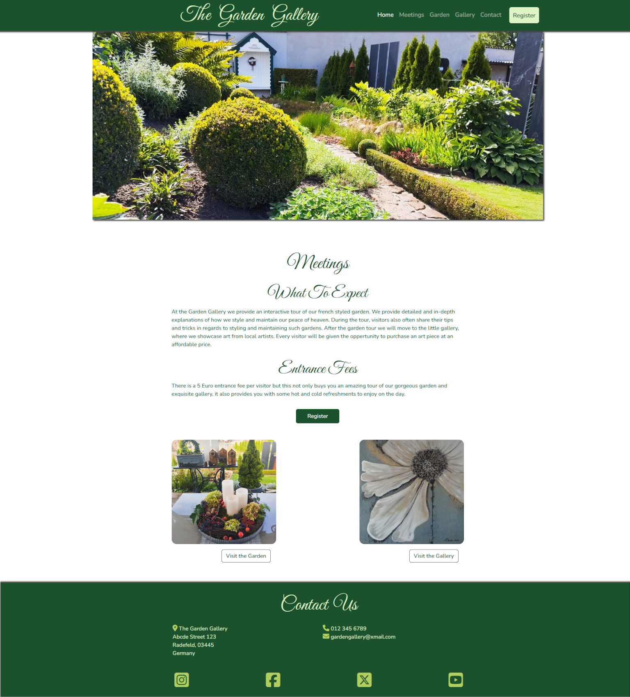
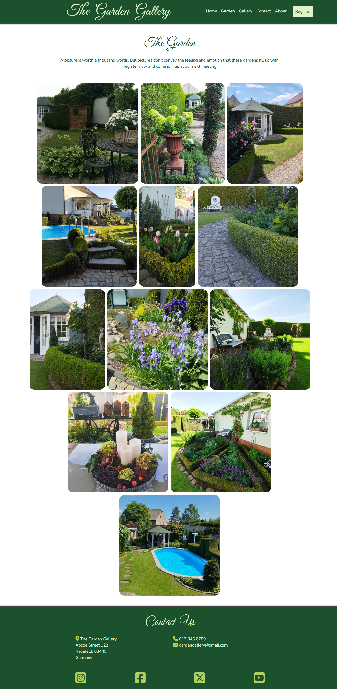
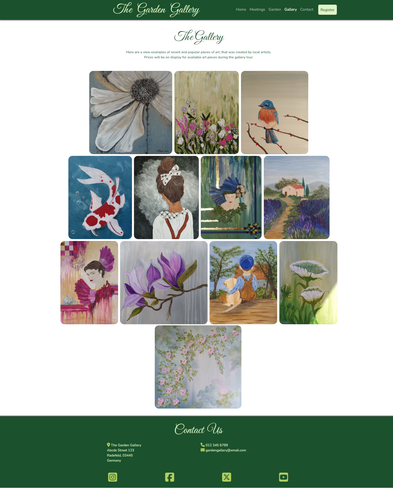
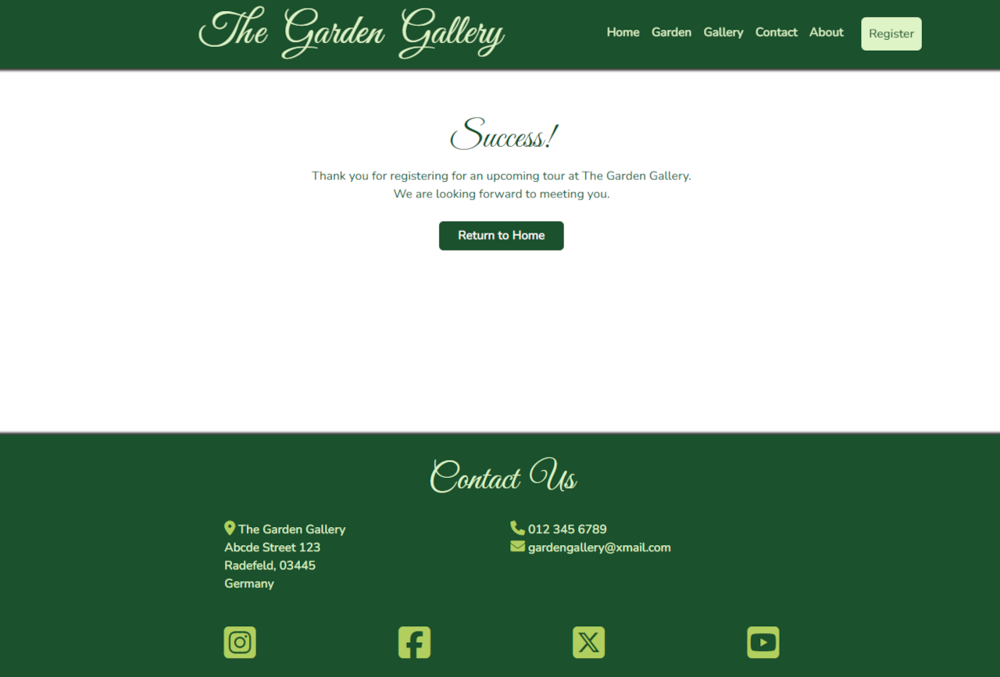
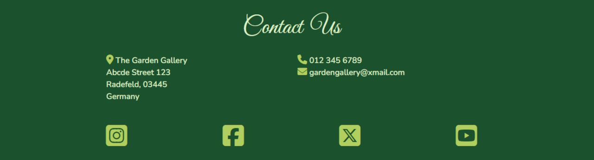

# The Garden Gallery

The Garden Gallery is small business, that operates from a private property in Radefeld Germany. The aim of the business is to organize social events, where a group of people sign up for a tour of the french styled garden. After the tour, they will be introduced to an art gallery, where they can make purchases. The goal of this website, is to increase their online presence and draw more people on a regular basis to their events.

The live website can be viewed here: [The Garden Gallery](https://gary-burke.github.io/the-garden-gallery/)

---

## User Experience

### User Stories

- As a potential new visitor, I would like to see a home page, that describes exactly what the event is about and what the entrance fees are.

- As a potential new visitor, it would be helpful if there were links with an image for guidance, to navigate to separate dedicated pages, which showcases the garden and the galley.

- As a garden enthusiast, I want to see a few pictures, showcasing the Garden and what to expect from attending the event.

- As an art enthusiast, I want to see a few pictures, showcasing the Gallery with multiple artwork.

- As a customer, there should be easily accessible and visible buttons throughout the website, where I can effortlessly register for an event.

- As a customer, I would like to see some sort of confirmation upon successful registration.

- As a potential visitor, there needs to be a clear and easily accessible contact section.

- As a potential visitor, it would be helpful to have a consistent and clear navigation system throughout the website.

## Design

### Typography

I have used [Google Fonts](https://fonts.google.com/) for this project and chose the following two fonts:

- **Great Vibes:** Used for all the main headings in the website. In order to accomodate the idea of the business, I opted for a artistic floral type of design. This font fit that criteria perfectly, aesthetically pleasing, yet still simple enough to read easily.

- **Nunito:** Used for all other text in on the website. It provides a great blend of complementing the heading but with a stark enough contrast to make reading easy.

### Colour Scheme

When thinking of the word "Garden", the colour green automatically comes to mind. Therefore, I used [Coolors](https://coolors.co/) to find a green colour palette that resemblances this thought and feeling of nature.

Here is a visual representation of the overall colour scheme of the website:

### Accessibility Considerations

In order ensure proper contrast and accessibility between the colours for readability, I used [webaim](https://webaim.org/resources/contrastchecker/) to check and adjust the colour variations accordingly.

In order to test and ensure that there is an adequate contrast between the two fronts, I used [fontjoy](https://fontjoy.com/).

### Wireframes

For this project I used Balsamiq to plan and draft the wireframes.

 

The Home Page (<em>Click to expand the wireframe</em>)

The Registration Page (<em>Click to expand the wireframe</em>)

The Garden Page (<em>Click to expand the wireframe</em>)

The Gallery Page (<em>Click to expand the wireframe</em>)

## Features

### Current Features

- **Navigation Bar**

  - The navbar is placed at the top of webpage with a fixed position. This gives the user the ease of navigation throughout the website, regardless of where thez are on a page. The navbar is identical on all pages.
  - The active page is highlighted and a hover effect appears, when hovering over the navigation items. There is also a call to action button, located at the end of the nav items with its' own hover styled effect.
    

- **The Home page**

  - The landing page displays a beautiful garden as a hero image, which is the foundation of the business. Within view is also the section, which describes what the business is about and how much the entrance fees to these meetings are.
  - There is another strategically placed call to action button, which allows the user to register for these events. I have decided to add two cards with navigation buttons here, taking the user directly to the garden and the gallery pages respectively.
    

- **The Garden Page**

  - The Garden page contains a few photos of the garden, which the meetings will revolve around. It showcases the different features, styles and angles of the scenes.
  - This is done with the Bootstrap grid system and arranges the pictures based on the screen breakpoints (repsonsiveness). There are rounded borders and sufficient gaps between the photos, to give it a clean styled look.
    

- **The Gallery Page**

  - The Gallery page contains a few photos of the various art, that has been displayed or still is being displayed at the gallery.
  - As with the Gallery page, this is done with the Bootstrap grid system and arranges the pictures based on the screen breakpoints (repsonsiveness). The same styles have been used as with the Gallery page.
    

- **The Registration Page**

  - A simple yet neat form has been used and styled in accordance with the rest of the website's overall design.
  - Only essential contact and personal information is required in addition to the choice of which event the user wants to attend.
  - All the input fields have a required attribute and input types, for example the email and phone number fields. Upon successful registration, a confirmation message will appear, which gives the user clarity and it is accompanied by a home button.
    
    

- **Footer**

  - The footer contains the contact us section and as with the navbar, is identical on all the pages.
  - It contains the address, the phone number as well as an email address.
    At the vey bottom, one can easily find all the relevant social media icons, which will open the websites on a new page.
    

### Future Features

- **Online Store**

  - It would be a great business venture, to create an online e-commerce store, where users can buy the art and view it online, without having to attend the event itself.

## Technologies Used

### Languages & Frameworks

- **HTML** – Used for the structure and content of the website.
- **CSS** – Used to style the website.
- **Bootstrap** – Predominantly used for responsive design, with the goal of having a mobile-first design. All the elements used from the Bootstrap library have been customized with CSS.
- **JavaScript** – Used in the standard Font Awesome Toolkit script, the Bootstrap library script and has been used for the function of the navbar, to ensure that it auto-closes on smaller devices.

### Development Tools

- **Git & GitHub** – Used for version control, tracking changes, and hosting the project repository.
- **Visual Studio Code** – The IDE used for developing the website.
- **Chrome Developer Tools** – Used to test responsiveness of the website, to debug and to inspect elements.
- **Am I Responsive** – Visual representation of website's responsiveness across different screen sizes. Added a screenshot to the start of this README.

### Design & UI Tools

- **Balsamiq Wireframes** – Used for planning and drafting the layout of all pages and sections within the website..
- **Coolors** – Helped to create a suitable colour palette for the website.
- **WebAIM Contrast Checker** – Used to test the colour contrast for readability and accessibility.
- **Google Fonts** – Used for custom fonts as they provide more authenticity and design style to the website.
- **Font Awesome** – Provided all manner of icons used within the website.
- **Favicon.io** – Used to generate a favicon for the website. The emoji graphics are from the open source project Twemoji. The graphics are copyright 2020 Twitter, Inc and other contributors. The graphics are licensed under CC-BY 4.0.
- **Fontjoy** - To find complementing fonts with sufficient contrast.

### Additional Tools

- **Gimp** - Used for all manner of image manipulation.
- **Autoprefixer** - Used to add vendor prefixes to CSS

## Deployment

The site was deployed to GitHub Pages. The steps to deploy are as follows:

- In the [GitHub repository](https://github.com/Gary-Burke/the-garden-gallery), navigate to the Settings tab 
- From the source section drop-down menu, select the **Main** Branch, then click "Save".
- The page will be automatically refreshed with a detailed ribbon display to indicate the successful deployment.

The live link can be found [here](https://gary-burke.github.io/the-garden-gallery)

### Local Deployment

This project can be cloned or forked in order to make a local copy on your own system.

#### Cloning

You can clone the repository by following these steps:

1. Go to the [GitHub repository](https://github.com/Gary-Burke/the-garden-gallery) 
2. Locate the Code button above the list of files and click it 
3. Select if you prefer to clone using HTTPS, SSH, or GitHub CLI and click the copy button to copy the URL to your clipboard
4. Open Git Bash or Terminal
5. Change the current working directory to the one where you want the cloned directory
6. In your IDE Terminal, type the following command to clone my repository:
	- `git clone https://github.com/Gary-Burke/the-garden-gallery.git`
7. Press Enter to create your local clone.

Alternatively, if using Gitpod, you can click below to create your own workspace using this repository.

Please note that in order to directly open the project in Gitpod, you need to have the browser extension installed.
A tutorial on how to do that can be found [here](https://www.gitpod.io/docs/configure/user-settings/browser-extension).

#### Forking

By forking the GitHub Repository, we make a copy of the original repository on our GitHub account to view and/or make changes without affecting the original owner's repository.
You can fork this repository by using the following steps:

1. Log in to GitHub and locate the [GitHub Repository](https://github.com/Gary-Burke/the-garden-gallery)
2. At the top of the Repository (not top of page) just above the "Settings" Button on the menu, locate the "Fork" Button.
3. Once clicked, you should now have a copy of the original repository in your own GitHub account!

### Local VS Deployment

There are no differences between the local and deployed version of the site.

## Testing

A thorough and extensive self-testing has been executed for this website to ensure that there are no broken links or bugs.
Every button and link across the website and all of its' pages functions correctly.
By using Chrome Dev Tools, the website has been tested and designed successfully for all breakpoints and screensizes.

### Validator Testing

- HTML
  - No errors or warnings were reported by the official [W3C validator](https://validator.w3.org/#validate_by_input).
- CSS
  - No errors were reported by the official [(Jigsaw) validator](https://jigsaw.w3.org/css-validator/#validate_by_input)

### Resolved Bugs

- Favicon - My initial favicon did not display and then I realized, that I had to update the paths for the images. The initial code, generated by [favicon.io](https://favicon.io) called for the images to be placed in the root directory.
- Buttons - Using Bootstrap buttons, I changed their styles but realized when clicking on the button, it still displayed the default blue colour. I had forgotten to remove the "btn-primary" class from the buttons and now it works as expected.

### Unresolved Bugs

There are no known bugs in the webiste.

## Credits

### Code Used

- As already mentioned, this website uses the standard Bootstrap library, Font Awesome Toolkit, Favicons and Google Fonts.
- The only additional code copied and used was the JavaScript code to ensure the Bootstrap mobile navbar collapses when navigating to in-page links. This code was copied from the CI Boardwalk Games project.

### Content

- The text of this website has been written personally by me. Although this location and concept for this business idea is real, it remains nonetheless a fictitious website.

### Media

- All the images have been personally provided by Sylvia Weber, the hostess of this Garden Gallery.

### Mentor
- My mentor, Tim Nelson, helped me quite a bit with the README document. He explained what is needed, why it is needed and what needs to be changed, especially in regards to the deployment and testing sections.
- He also advised me on adding the 404 page to my project. 
