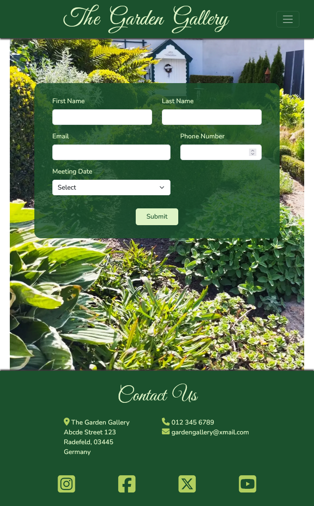
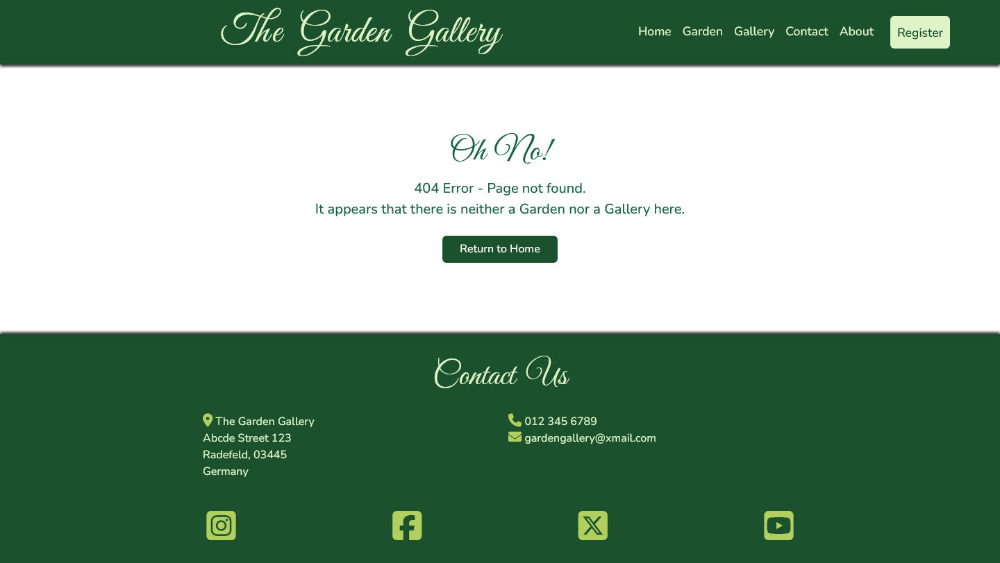
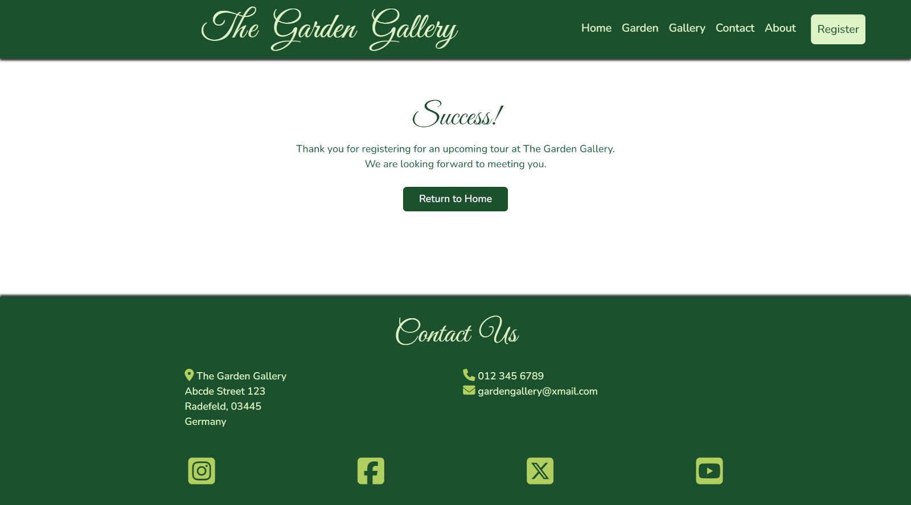

# Testing

> [!Note]
> Return back to the [README.md](README.md) file.

## Code Validation

### HTML

I have used the recommended [HTML W3C Validator](https://validator.w3.org) to validate all of my HTML files.

| Directory | File | URL | Screenshot | Notes |
| --- | --- | --- | --- | --- |
| root | [404.html](https://github.com/Gary-Burke/the-garden-gallery/blob/main/404.html) | [HTML Validator](https://validator.w3.org/nu/?doc=https://gary-burke.github.io/the-garden-gallery/404.html) |  | No errors or warnings |
| root | [gallery.html](https://github.com/Gary-Burke/the-garden-gallery/blob/main/gallery.html) | [HTML Validator](https://validator.w3.org/nu/?doc=https://gary-burke.github.io/the-garden-gallery/gallery.html) |  | No errors or warnings |
| root | [garden.html](https://github.com/Gary-Burke/the-garden-gallery/blob/main/garden.html) | [HTML Validator](https://validator.w3.org/nu/?doc=https://gary-burke.github.io/the-garden-gallery/garden.html) |  | No errors or warnings |
| root | [index.html](https://github.com/Gary-Burke/the-garden-gallery/blob/main/index.html) | [HTML Validator](https://validator.w3.org/nu/?doc=https://gary-burke.github.io/the-garden-gallery/index.html) |  | No errors or warnings |
| root | [register.html](https://github.com/Gary-Burke/the-garden-gallery/blob/main/register.html) | [HTML Validator](https://validator.w3.org/nu/?doc=https://gary-burke.github.io/the-garden-gallery/register.html) |  | No errors or warnings |
| root | [success.html](https://github.com/Gary-Burke/the-garden-gallery/blob/main/success.html) | [HTML Validator](https://validator.w3.org/nu/?doc=https://gary-burke.github.io/the-garden-gallery/success.html) |  | No errors or warnings |

### CSS

I have used the recommended [CSS Jigsaw Validator](https://jigsaw.w3.org/css-validator) to validate all of my CSS files.

| Directory | File | URL | Screenshot | Notes |
| --- | --- | --- | --- | --- |
| assets | [styles.css](https://github.com/Gary-Burke/the-garden-gallery/blob/main/assets/css/styles.css) | [CSS Validator](https://jigsaw.w3.org/css-validator/validator?uri=https://gary-burke.github.io/the-garden-gallery) |  | All warnings were checked and can be safely ignored. Such as for the Bootstrap and Font Awesome libraries, vendor extensions added by Autoprefixer, the Google Fonts import and CSS variables that are not checked. |

## Responsiveness

I've tested my deployed project to check for responsiveness issues by using Google Chrome Dev Tools.

| Page | Mobile | Tablet | Desktop | Notes |
| --- | --- | --- | --- | --- |
| Home |  |  |  | Works as expected |
| Garden |  |  |  | Works as expected |
| Gallery |  |  |  | Works as expected |
| Registration |  |  |  | Works as expected |
| Success |  |  |  | Works as expected |
| 404 |  |  |  | Works as expected |

## Browser Compatibility

I've tested my deployed project on three different browsers to check for compatibility issues.

| Page | Chrome | Firefox | Edge | Notes |
| --- | --- | --- | --- | --- |
| Home |  |  |  | Works as expected |
| Garden |  |  |  | Works as expected |
| Gallery |  |  |  | Works as expected |
| Register |  |  |  | Works as expected |
| Success |  |  |  | Works as expected |
| 404 |  |  |  | Works as expected |

## Lighthouse Audit

I've tested my deployed project using the Lighthouse Audit tool to check for any major issues. Some warnings are outside of my control, and mobile results tend to be lower than desktop.

| Page | Mobile | Desktop |
| --- | --- | --- |
| Home |  |  |
| Garden |  |  |
| Gallery |  |  |
| Register |  |  |
| Success |  |  |
| 404 |  |  |

## Defensive Programming

Defensive programming was manually tested with following criteria and outcome:

| Page | Expectation | Test | Result | Screenshot |
| --- | --- |  --- |  --- |  --- |
| Registration Form | Feature is expected to prevent an empty form from being submitted. | Attempted to submit the form when all fields were left blank. | Form submission was blocked, as expected. |  |
| | Feature is expected to ensure a last name is entered. | Attempted to submit the form without adding a last name. | Form submission was blocked, as expected. |  |
| | Feature is expected to ensure an e-mail is entered. | Attempted to submit the form without adding an e-mail address. | Form submission was blocked, as expected. |  |
| | Feature is expected to enforce valid input for the email field. | Entered invalid data, i.e. did not add the @ sign. | Error message was displayed accordingly, and submission was blocked. |  |
| | Feature is expected to ensure a phone number is entered. | Attempted to submit the form without adding a phone number. | Error messages were displayed appropriately, and submission was blocked. |  |
| | Feature is expected to ensure the user chooses an event. | Attempted to submit the form without selecting an event. | Error messages were displayed appropriately, and submission was blocked. |  |
| Social Links | Feature is expected to open each social media platform in a new tab. | Clicked each social media icon respectively. | Confirmed that each link opened correctly and in a new tab. |  |
| 404 Error Page | Feature is expected to display a 404 error message for broken links or non-existing pages. | Typed in an invalid URL (e.g., `/dream`) to test the outcome. | An appropriate 404 error page was displayed as expected. |  |

## User Story Testing

| Target | Expectation | Outcome | Screenshot | 
| --- | --- | --- | --- | 
| As a new visitor | I would like to see a home page, that describes exactly what the event is about and what the entrance fees are | so that I can know what to expect and how much it costs. |  |
| As a new visitor | it would be helpful if there were links with an image for guidance, to navigate to separate dedicated pages | which showcases the garden and the gallery. |  |
| As a new visitor | there should be easily accessible and visible buttons throughout the website  | so that I can effortlessly register for an event. |  |
| As a new visitor | I would like to see some sort of confirmation upon successful registration | so that I can be sure that it was successful. |  |
| As a new visitor |  there needs to be a clear and easily accessible contact section | so that I can get further information if needed. |  |
| As a new visitor | it would be helpful to have a consistent and clear navigation system throughout the website | so that I don't get lost or confused between pages. |  |
| As a garden enthusiast | I want to see a few pictures, showcasing the Garden | so that I can be well prepared |  |
| As an art enthusiast | I want to see a few pictures, showcasing the Gallery with multiple artwork | so that I can better understand the range of art. |  |

## Bugs

> [!Note]
> I did not document my bugs on GitHub initially. After the first discussion session with my mentor, Tim Nelson, he showed me this method of using GitHub to track your bugs. For documentation purposes, I have transferred all of my bugs to my project in GitHub afterwards, hence no history or track record between creating and resolving them.

### Fixed Bugs

I've used [GitHub Issues](https://www.github.com/Gary-Burke/the-garden-gallery/issues) to track and manage bugs and issues during the development stages of my project.

All previously closed/fixed bugs can be tracked [here](https://www.github.com/Gary-Burke/the-garden-gallery/issues?q=is%3Aissue+is%3Aclosed+label%3Abug).

### Unfixed Bugs

- There are no remaining bugs or problems that I am aware of in this project and website. 
- Eventhough thorough testing was executed, the possibility remains that there could still be some error or bug, that has not been discovered yet.

