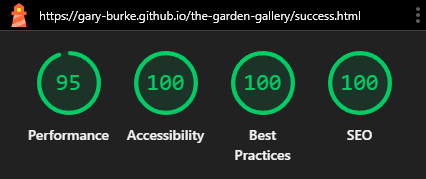

# Testing

> [!Note]
> Return back to the [README.md](README.md) file.

## Code Validation

### HTML

I have used the recommended [HTML W3C Validator](https://validator.w3.org) to validate all of my HTML files.

| Directory | File | URL | Screenshot | Notes |
| --- | --- | --- | --- | --- |
| root | [404.html](https://github.com/Gary-Burke/the-garden-gallery/blob/main/404.html) | [HTML Validator](https://validator.w3.org/nu/?doc=https://gary-burke.github.io/the-garden-gallery/404.html) |  | No errors or warnings |
| root | [gallery.html](https://github.com/Gary-Burke/the-garden-gallery/blob/main/gallery.html) | [HTML Validator](https://validator.w3.org/nu/?doc=https://gary-burke.github.io/the-garden-gallery/gallery.html) |  | No errors or warnings |
| root | [garden.html](https://github.com/Gary-Burke/the-garden-gallery/blob/main/garden.html) | [HTML Validator](https://validator.w3.org/nu/?doc=https://gary-burke.github.io/the-garden-gallery/garden.html) |  | No errors or warnings |
| root | [index.html](https://github.com/Gary-Burke/the-garden-gallery/blob/main/index.html) | [HTML Validator](https://validator.w3.org/nu/?doc=https://gary-burke.github.io/the-garden-gallery/index.html) |  | No errors or warnings |
| root | [register.html](https://github.com/Gary-Burke/the-garden-gallery/blob/main/register.html) | [HTML Validator](https://validator.w3.org/nu/?doc=https://gary-burke.github.io/the-garden-gallery/register.html) |  | No errors or warnings |
| root | [success.html](https://github.com/Gary-Burke/the-garden-gallery/blob/main/success.html) | [HTML Validator](https://validator.w3.org/nu/?doc=https://gary-burke.github.io/the-garden-gallery/success.html) |  | No errors or warnings |

### CSS

I have used the recommended [CSS Jigsaw Validator](https://jigsaw.w3.org/css-validator) to validate all of my CSS files.

| Directory | File | URL | Screenshot | Notes |
| --- | --- | --- | --- | --- |
| assets | [styles.css](https://github.com/Gary-Burke/the-garden-gallery/blob/main/assets/css/styles.css) | [CSS Validator](https://jigsaw.w3.org/css-validator/validator?uri=https://gary-burke.github.io/the-garden-gallery) |  | All warnings were checked and can be safely ignored. Such as for the Bootstrap and Font Awesome libraries, vendor extensions added by Autoprefixer, the Google Fonts import and CSS variables that are not checked. |

## Responsiveness

I've tested my deployed project to check for responsiveness issues by using Google Chrome Dev Tools.

| Page | Mobile | Tablet | Desktop | Notes |
| --- | --- | --- | --- | --- |
| Home |  |  |  | Works as expected |
| Garden |  |  |  | Works as expected |
| Gallery |  |  |  | Works as expected |
| Registration |  |  |  | Works as expected |
| Success |  |  |  | Works as expected |
| 404 |  |  |  | Works as expected |

## Browser Compatibility

I've tested my deployed project on three different browsers to check for compatibility issues.

| Page | Chrome | Firefox | Edge | Notes |
| --- | --- | --- | --- | --- |
| Home |  |  |  | Works as expected |
| Garden |  |  |  | Works as expected |
| Gallery |  |  |  | Works as expected |
| Register |  |  |  | Works as expected |
| Success |  |  |  | Works as expected |
| 404 |  |  |  | Works as expected |

## Lighthouse Audit

I've tested my deployed project using the Lighthouse Audit tool to check for any major issues. Some warnings are outside of my control, and mobile results tend to be lower than desktop.

| Page | Mobile | Desktop |
| --- | --- | --- |
| Home |  |  |
| Garden |  |  |
| Gallery |  |  |
| Register |  |  |
| Success |  |  |
| 404 |  |  |

## Defensive Programming

⚠️ INSTRUCTIONS ⚠️

Defensive programming (defensive design) is extremely important! When building projects that accept user inputs or forms, you should always test the level of security for each form field. Examples of this could include (but not limited to):

All Projects:

- Users cannot submit an empty form (add the `required` attribute)
- Users must enter valid field types (ensure the correct input `type=""` is used)
- Users cannot brute-force a URL to navigate to a restricted pages

Python Projects:

- Users cannot perform CRUD functionality if not authenticated (if login functionality exists)
- User-A should not be able to manipulate data belonging to User-B, or vice versa
- Non-Authenticated users should not be able to access pages that require authentication
- Standard users should not be able to access pages intended for superusers/admins

You'll want to test all functionality on your application, whether it's a standard form, or CRUD functionality, for data manipulation on a database. Try to access various pages on your site as different user types (User-A, User-B, guest user, admin, superuser). You should include any manual tests performed, and the expected results/outcome.

Testing should be replicable (can someone else replicate the same outcome?). Ideally, tests cases should focus on each individual section of every page on the website. Each test case should be specific, objective, and step-wise replicable.

Instead of adding a general overview saying that everything works fine, consider documenting tests on each element of the page (eg. button clicks, input box validation, navigation links, etc.) by testing them in their "happy flow", their "bad/exception flow", mentioning the expected and observed results, and drawing a parallel between them where applicable.

Consider using the following format for manual test cases:

- Expected Outcome / Test Performed / Result Received / Fixes Implemented

- **Expected**: "Feature is expected to do X when the user does Y."
- **Testing**: "Tested the feature by doing Y."
- (either) **Result**: "The feature behaved as expected, and it did Y."
- (or) **Result**: "The feature did not respond to A, B, or C."
- **Fix**: "I did Z to the code because something was missing."

Use the table below as a basic start, and expand on it using the logic above.

⚠️ --- END --- ⚠️

Defensive programming was manually tested with the below user acceptance testing:

| Page | Expectation | Test | Result | Screenshot |
| --- | --- |  --- |  --- |  --- |
| Home | Feature is expected to display examples of why users should join. | Verified that the page displays the club’s mission and purpose in a clear and concise manner. | The mission and purpose were displayed as expected. |  |
| | Feature is expected to have accessible navigation links. | Checked navigation links for correct functionality and accessibility. | Navigation links were functional and accessible. |  |
| | Feature is expected to be fully responsive. | Resized the browser window and tested on multiple devices (mobile, tablet, desktop). | The page was responsive across all tested screen sizes. |  |
| Schedule/Timetable | Feature is expected to show the running schedule/timetable for sessions. | Confirmed that the page contains a structured table or list with session timings. | Timetable was displayed as expected. |  |
| Events | Feature is expected to display details of different running events. | Verified that the page lists upcoming events with relevant details. | Event details were displayed as expected. |  |
| Gallery | Feature is expected to showcase a gallery of past events. | Verified that the gallery contains clear images that aren't stretched, pixelated, and fully responsive. | Images are properly sized, and respond well to different device sizes. |  |
| Sign-Up Form | Feature is expected to prevent submission of an empty form. | Attempted to submit the form without filling any fields. | Form submission was blocked, as expected. |  |
| | Feature is expected to enforce valid input types for each field. | Entered invalid data (e.g., random text in an email field, numbers in a name field, etc.). | Error messages were displayed appropriately, and submission was blocked. |  |
| Social Links | Feature is expected to include working links to the club’s social platforms (Instagram, Facebook, etc.). | Clicked each social link to verify redirection to the correct platform page. | All links redirected to the correct platform pages, opening in new browser tabs. |  |
| 404 Error Page | Feature is expected to display a 404 error page for non-existent pages. | Navigated to an invalid URL (e.g., `/test`) to test error handling. | A custom 404 error page was displayed as expected. |  |

## User Story Testing

| Target | Expectation | Outcome | Screenshot | 
| --- | --- | --- | --- | 
| As a new visitor | I would like to see a home page, that describes exactly what the event is about and what the entrance fees are | so that I can know what to expect and how much it costs. |  |
| As a new visitor | it would be helpful if there were links with an image for guidance, to navigate to separate dedicated pages | which showcases the garden and the gallery. |  |
| As a new visitor | there should be easily accessible and visible buttons throughout the website  | so that I can effortlessly register for an event. |  |
| As a new visitor | I would like to see some sort of confirmation upon successful registration | so that I can be sure that it was successful. |  |
| As a new visitor |  there needs to be a clear and easily accessible contact section | so that I can get further information if needed. |  |
| As a new visitor | it would be helpful to have a consistent and clear navigation system throughout the website | so that I don't get lost or confused between pages. |  |
| As a garden enthusiast | I want to see a few pictures, showcasing the Garden | so that I can be well prepared |  |
| As an art enthusiast | I want to see a few pictures, showcasing the Gallery with multiple artwork | so that I can better understand the range of art. |  |

## Bugs

> [!Note]
> I did not document my bugs on GitHub initially. After the first discussion session with my mentor, Tim Nelson, he showed me this method of using GitHub to track your bugs. For documentation purposes, I have transferred all of my bugs to my project in GitHub afterwards, hence no history or track record between creating and resolving them.

### Fixed Bugs

I've used [GitHub Issues](https://www.github.com/Gary-Burke/the-garden-gallery/issues) to track and manage bugs and issues during the development stages of my project.

All previously closed/fixed bugs can be tracked [here](https://www.github.com/Gary-Burke/the-garden-gallery/issues?q=is%3Aissue+is%3Aclosed+label%3Abug).

### Unfixed Bugs

⚠️ INSTRUCTIONS ⚠️

You will need to mention any unfixed bugs and why they are not fixed upon submission of your project. This section should include shortcomings of the frameworks or technologies used. Although time can be a big variable to consider, paucity of time and difficulty understanding implementation is not a valid reason to leave bugs unfixed. Where possible, you must fix all outstanding bugs, unless outside of your control.

If you've identified any unfixed bugs, no matter how small, be sure to list them here! It's better to be honest and list them, because if it's not documented and an assessor finds the issue, they need to know whether or not you're aware of them as well, and why you've not corrected/fixed them.

⚠️ --- END --- ⚠️

Any remaining open issues can be tracked [here](https://www.github.com/Gary-Burke/the-garden-gallery/issues).

### Known Issues

| Issue | Screenshot |
| --- | --- |
| On devices smaller than 375px, the page starts to have horizontal `overflow-x` scrolling. |  |
| When validating HTML with a semantic `<section>` element, the validator warns about lacking a header `h2-h6`. This is acceptable. |  |

> [!IMPORTANT]
> There are no remaining bugs that I am aware of, though, even after thorough testing, I cannot rule out the possibility.

